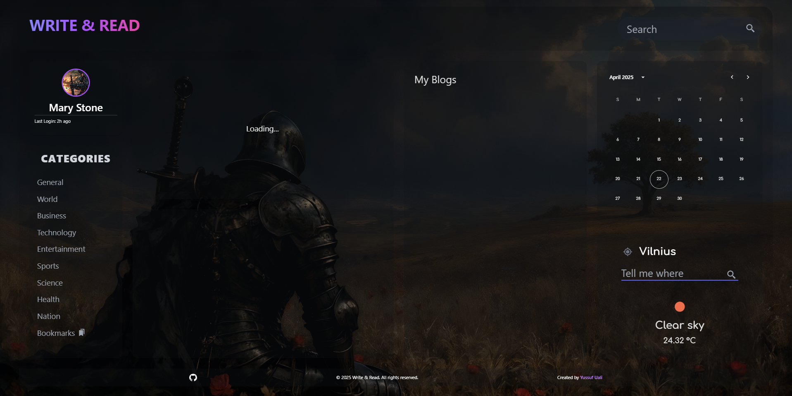
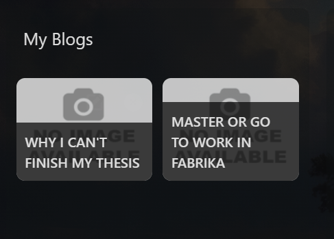
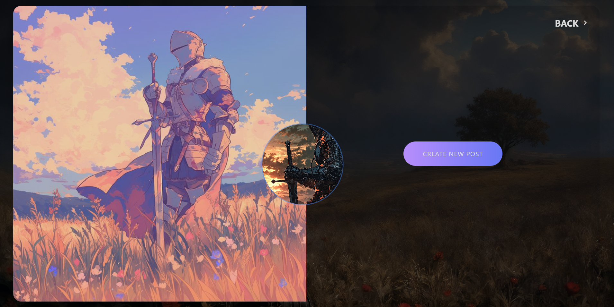

# 📰 Write & Read – Blog & News Dashboard

Welcome to **Write & Read**, a modern and responsive blog + news dashboard built with **React**, **Tailwind CSS**, and **Vite**. This project combines live news updates, personal blog posting, and elegant UI to create an immersive reading and writing experience.



---

## 🚀 Features

- 🔥 **Live News Feed** using the GNews API
- ✍️ **Create & Edit Blog Posts** with image uploads
- 🧾 **View Blog Content in Modals** (clean and focused UI)
- 📅 Integrated Calendar Widget
- ☁️ Live Weather Display with Location Input
- 🌙 Full Gradient + Dark UI with rich visuals
- 💾 Blogs are saved to **localStorage**
- 🎯 Responsive design with smooth animations

---

## 🛠 Tech Stack

| Tech             | Usage                             |
| ---------------- | --------------------------------- |
| **React**        | Frontend UI library               |
| **Vite**         | Lightning-fast development server |
| **Tailwind CSS** | Utility-first styling             |
| **Axios**        | Fetching news from GNews API      |
| **GNews API**    | Live top headlines                |
| **localStorage** | Persistent blog storage           |

---

## 📸 Screenshots

### Blog View



### News + Calendar View


### Create Blog Modal



---

## 🧪 Local Setup

```bash
# 1. Clone the repo
git clone https://github.com/yourusername/write-and-read.git
cd write-and-read

# 2. Install dependencies
npm install

# 3. Add your API key (GNews)
# Create a `.env` file and insert:
VITE_NEWS_KEY=your_gnews_api_key

# 4. Start the dev server
npm run dev
```
